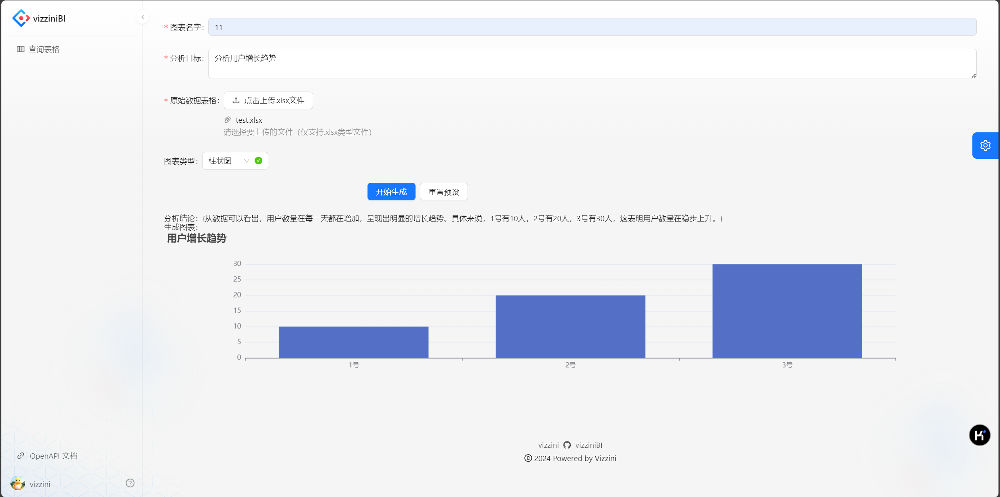
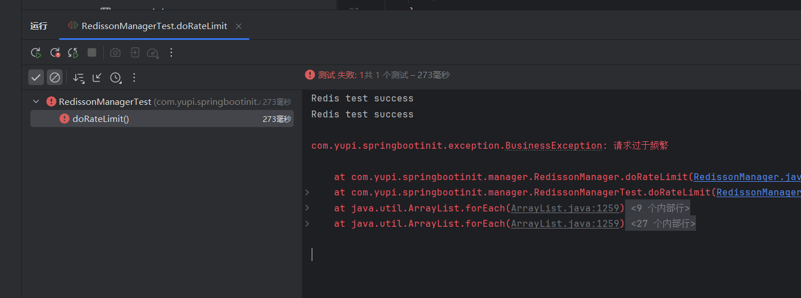

# Vizzini BI

> 作者：济楚
> Vizzinii
> 
> https://github.com/Vizzinii

基于 Java SpringBoot 的智能数据分析BI平台。

## 技术栈
- SpringBoot 框架
- Spring MVC
- MySQL
- MyBatis Plus 数据访问框架
- RabbitMQ
- 接入 AI 接口
- Easy Excel 实现 Excel 的上传和其中数据的解析
- Swagger + Knife4j 项目接口文档
- Hutool 工具库

*2024-11-10 18:23 前后端联调成功*

*2024-11-11 17:06 实现了用Redis控制流量*
